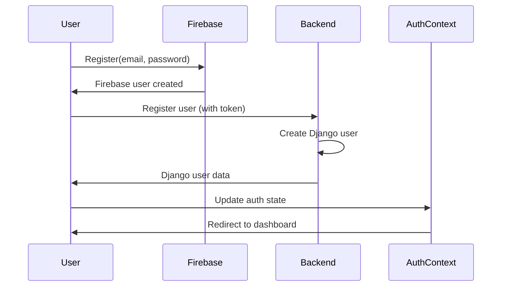
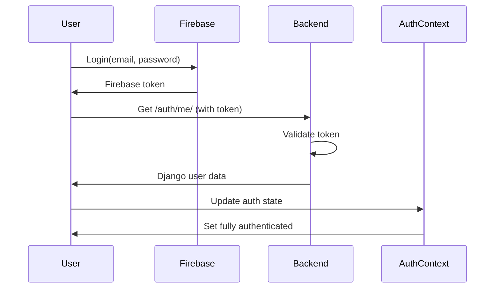
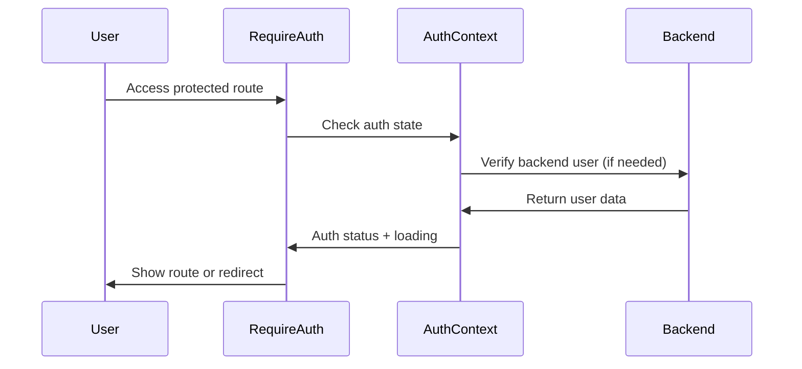

# Authentication Architecture

## Task 3: Global Firebase Auth State
- Firebase Authentication for client-side user management
- Global auth state using React Context API
- Route protection with RequireAuth and RequireGuest components
- Basic login, register, and logout functionality

## Task 4: Backend Integration & Complete Auth Flow

### Overview
Task 4 completes the authentication system by integrating the frontend Firebase auth state with the Django backend, creating a dual authentication system that provides both client-side and server-side security.

### Architecture Components

#### 1. Backend Auth Endpoint (`/api/users/auth/me/`)
- **Purpose**: Validates Firebase token and returns Django user data
- **Authentication**: Uses custom `FirebaseAuthentication` class
- **Response**: Returns complete Django user object with roles and permissions
- **Security**: Validates JWT token from Firebase before accessing Django data

#### 2. Frontend API Service Layer
```
src/services/
├── api.js                 # Axios instance with interceptors
├── authService.js         # Auth-specific API calls
└── todoService.js         # Todo API calls
```

**Key Features:**
- **Request Interceptor**: Automatically attaches Firebase ID token to all API requests
- **Response Interceptor**: Handles 401/403 errors and redirects to login
- **Centralized Error Handling**: Consistent error management across all API calls

#### 3. Enhanced AuthContext
```
src/context/AuthContext.jsx
```

**State Management:**
- `user`: Firebase user object (client-side)
- `backendUser`: Django user object (server-side)
- `isAuthenticated`: Boolean for overall auth status
- `loading`: Combined loading state for both auth systems

**Authentication Flow:**
1. **Login**: Firebase auth → Backend auth → Update both user states
2. **Register**: Firebase create → Backend register → Fetch backend user data
3. **Logout**: Clear both Firebase and Django user states
4. **Token Refresh**: Automatic Firebase token refresh with backend validation

#### 4. React Query Integration
```
src/hooks/
├── useAuthQuery.js        # Auth-related queries
└── useTodoQueries.js      # Todo API queries and mutations
```

**Data Fetching Strategy:**
- **Queries**: Use TanStack Query for server state management
- **Mutations**: Automatic cache invalidation after data changes
- **Optimistic Updates**: Immediate UI updates with rollback on errors
- **Stale Time**: Configurable cache durations for different data types

#### 5. Enhanced Route Guards
```
src/routes/
├── RequireAuth.jsx        # Protected route guard
└── RequireGuest.jsx       # Public-only route guard
```

**Security Enhancements:**
- **Dual Authentication**: Checks both Firebase AND Django auth states
- **Loading States**: Shows loading spinner while verifying auth
- **Graceful Fallbacks**: Redirects to appropriate pages based on auth status

### Complete Authentication Flow

#### User Registration


#### User Login


#### Protected Route Access


### Key Integration Points

#### Firebase + Django Synchronization
- **User Creation**: Atomic operation creates both Firebase and Django users
- **Token Flow**: Firebase tokens automatically attached to all Django requests
- **Data Consistency**: Backend validates Firebase tokens before accessing Django data
- **Error Handling**: Frontend handles auth failures gracefully with redirects

#### Security Features
- **JWT Validation**: Comprehensive token verification on backend
- **Object-level Permissions**: Django permissions based on user roles
- **Automatic Token Refresh**: Firebase handles token refresh seamlessly
- **Session Management**: Proper cleanup on logout from both systems

#### Performance Optimizations
- **Caching**: React Query caches API responses with configurable stale times
- **Automatic Refetching**: Smart cache invalidation on data changes
- **Loading States**: Proper loading indicators during auth verification
- **Error Boundaries**: Graceful error handling throughout the auth flow

### File Structure Summary
```
frontend/src/
├── context/
│   └── AuthContext.jsx           # Global auth state management
├── services/
│   ├── api.js                   # Axios configuration
│   ├── authService.js           # Auth API calls
│   └── todoService.js           # Todo API calls
├── hooks/
│   ├── useAuthQuery.js          # Auth-related queries
│   └── useTodoQueries.js        # Todo API queries/mutations
├── routes/
│   ├── RequireAuth.jsx          # Protected route guard
│   └── RequireGuest.jsx         # Public route guard
└── App.jsx                      # Main app with QueryClientProvider
```

### Development Notes

#### Authentication States
- **Not Authenticated**: No Firebase user
- **Partially Authenticated**: Firebase user but no Django user
- **Fully Authenticated**: Both Firebase and Django users exist
- **Loading**: Checking authentication status

#### Error Scenarios
- **Backend User Not Found**: User exists in Firebase but not Django (requires registration)
- **Invalid Token**: Firebase token expired or invalid (triggers re-authentication)
- **Network Errors**: API failures handled gracefully with retry logic
- **Permission Denied**: User lacks required permissions (redirects to appropriate page)

#### Testing Considerations
- Test both successful and failed authentication flows
- Verify token attachment to API requests
- Test route protection under various auth states
- Ensure proper cleanup on logout
- Test error scenarios and edge cases

This architecture provides a robust, secure, and user-friendly authentication system that leverages the strengths of both Firebase (client-side convenience) and Django (server-side security).